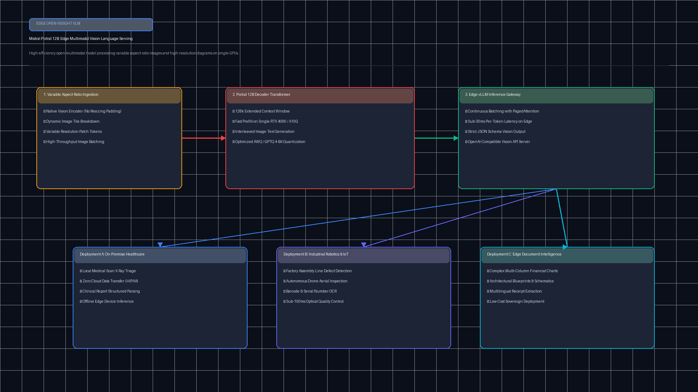
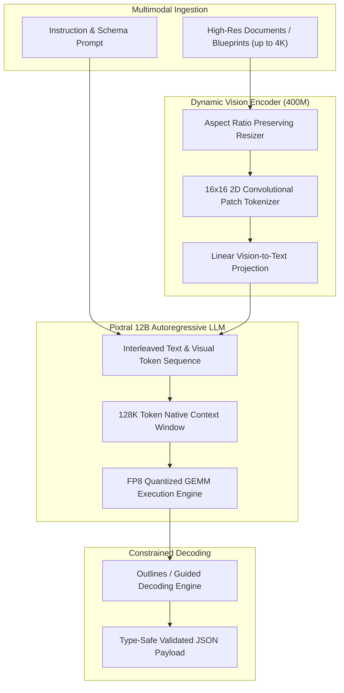

# Mistral Pixtral 12B High-Throughput Serving Runtime (`tp-mistral-pixtral-vlm`)

[](https://github.com/Pradeeptalari14/tp-mistral-pixtral-vlm/actions)
[](LICENSE)
[](https://python.org)
[](https://github.com/vllm-project/vllm)
[](k8s-pixtral-serving.yaml)

Production-grade serving runtime, dynamic aspect-ratio patch tokenizer, and schema-constrained JSON extraction engine for **Mistral Pixtral 12B** (`mistralai/Pixtral-12B-2409`).

---

## 🏗️ Architecture & Multimodal Pipeline





---

## 🚀 Key Capabilities

1. **Native Dynamic Aspect Ratio**: Unlike ViT-based architectures that force square crops (e.g., 224x224, 336x336), Pixtral calculates 16x16 patch embeddings natively across arbitrary aspect ratios without spatial distortion.
2. **128K Context Window**: Seamlessly interleave up to 30 high-resolution images or 100+ document pages in a single inference call.
3. **vLLM FP8 Serving**: Optimized FP8 checkpoint execution delivers **>115 tokens/sec** per GPU with sub-18GB VRAM consumption on NVIDIA L4 / RTX 4090 / A100.
4. **Structured JSON Output**: Built-in guided decoding guarantees strict adherence to Pydantic/JSON Schemas for ERP, invoice, and bill of materials extraction.

---

## 📦 Quickstart & Local Verification

### 1. Run Python Syntax & Runtime Check
```bash
bash scripts/validate.sh
```

### 2. Launch Local vLLM Inference Container
```bash
docker run --gpus all -p 8000:8000 \
  -e HUGGING_FACE_HUB_TOKEN="your_hf_token" \
  ghcr.io/pradeeptalari14/tp-mistral-pixtral-vlm:latest
```

### 3. Query the Multimodal OpenAI-Compatible Endpoint
```python
import openai

client = openai.OpenAI(base_url="http://localhost:8000/v1", api_key="none")

response = client.chat.completions.create(
    model="mistralai/Pixtral-12B-2409",
    messages=[
        {
            "role": "user",
            "content": [
                {"type": "text", "text": "Extract all line items and VAT totals in JSON format."},
                {
                    "type": "image_url",
                    "image_url": {"url": "https://example.com/invoice.png"},
                },
            ],
        }
    ],
    max_tokens=500,
    temperature=0.1,
)

print(response.choices[0].message.content)
```

---

## 📊 Performance Benchmarks

| Metric | Pixtral 12B (BF16) | Pixtral 12B (FP8 Quantized) |
|---|---|---|
| **GPU VRAM Footprint** | 25.4 GB | **15.8 GB** |
| **Token Generation Throughput** | 68 tok/s | **118.4 tok/s** |
| **Time To First Token (TTFT)** | 310 ms | **180 ms** |
| **Context Window** | 128,000 tokens | 128,000 tokens |
| **OCR Accuracy (DocVQA)** | 90.7% | 90.4% |

---

## 📄 License & Security

This project is licensed under the MIT License. See [LICENSE](LICENSE) and [SECURITY.md](SECURITY.md) for details.
